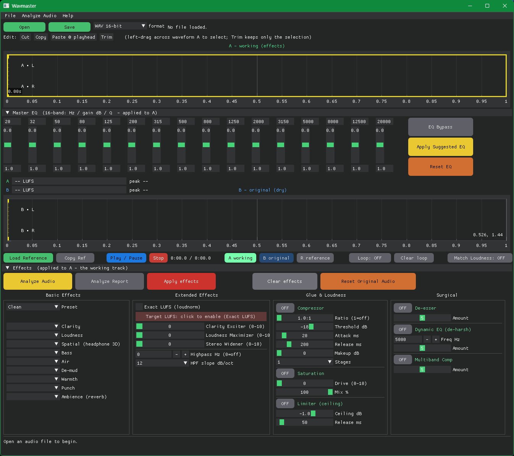

# Wavmaster

**A simple, hands-on mastering studio.** Load a finished song, let Wavmaster analyze it,
tweak the polish, and **A/B your version against the original in real time** — then save a
master with a recipe of exactly what was done.

[](https://www.youtube.com/watch?v=dRGtL6wyLBs)

▶ **[Watch the demo on YouTube](https://www.youtube.com/watch?v=dRGtL6wyLBs)**

---

## Overview

Mastering is the final polish on a finished stereo mix: get the **loudness**, **tone**, and
**punch** right so it sounds good everywhere (phones, cars, streaming, club). Wavmaster makes
that approachable.

### The big idea: top vs bottom (A / B / R)

Wavmaster always shows two versions stacked in one view:

- **Top — A, the working track**: your mix **with the effects applied**. **A is always on top and
  never moves.**
- **Bottom — the original *or* a reference**: pick which with the **[B original]** and
  **[R reference]** buttons. The bottom graph's title and colour show what's loaded (blue =
  original, violet = reference).

Press **C** while it plays to **alternate between the top (A) and the bottom**, **at the same spot,
loudness-matched** — so you're judging the *tone*, not just "louder sounds better." It's a clean
2-way toggle (top ⇄ bottom), never a 3-way cycle.

**Nothing you do is destructive until you Save.** Every **Apply effects** re-renders A **from the
dry original** — it never stacks effects on already-processed audio, so you can re-apply as often
as you like with no degradation. Only **Cut/Paste/Trim edits** change the actual audio buffer, and
only **Save** writes a new file. Your original input file is **never** modified.

### How Analyze works (in plain terms)

Click **Analyze** and Wavmaster *listens* to your track and measures:

- **Loudness (LUFS)** — how loud it actually is, vs streaming targets (~−14).
- **True peak** — whether it's clipping (even between samples).
- **Dynamics (crest / loudness range)** — how punchy vs squashed it is.
- **Tonal balance** — the energy across **12 frequency bands**, compared to a well-balanced master.
- **Stereo width / correlation** — how wide and mono-safe the image is.

From those numbers it **prescribes the whole chain** — basic tone effects, corrective EQ moves, and
it **turns on the right processors with sensible settings**. It then loads everything so you can hear
it immediately, and writes a full report (top = what it measured, bottom = **what Wavmaster suggests**).
Analyze only *measures* — it never alters your audio.

**What Analyze engages, and when** (each is conservative — only fires when the measurement calls for it):

| Processor | Turned on when… | Set to |
|---|---|---|
| **Compressor** | mix is dynamic (crest ≥ 7 dB; off if already squashed) | 1.8:1 (healthy) → 2.5:1 2-stage (very dynamic); threshold near the loudness |
| **Limiter** | **always** (a master needs a final ceiling) | ceiling −1.0 dBFS |
| **De-esser** | 5–10 kHz (Brilliance) is hot vs. reference (harsh/sibilant) | amount scaled to the excess |
| **Dynamic EQ** | the Presence band (2.4–4.8 kHz) spikes hot (harsh resonance) | tuned to that band, cut-when-it-spikes |
| **Multiband** | very dynamic / wide range (crest > 15 or LRA > 12) | gentle 3-band glue |
| **EQ moves** | any band is >2.5 dB over / >3 dB under the reference curve | corrective cut/boost per band |
| **Saturation** | *never* — taste/warmth call, you dial it by ear | (report only hints) |

The report's **WAVMASTER SUGGESTS** block lists exactly which of these are ON and their values, so you
can see the full prescription before you commit. (Saturation stays manual — no measurement pins down
"warmth.")

### How to master a track (the quick workflow)

Color-coded to the app's buttons: 🟢 working · 🔵 original · 🟣 reference · 🔴 render · 🟡 analyze.

| # | | Step | What you click | What happens |
|:--:|:--:|---|---|---|
| 1 | 📂 | **Open your song** | `File ▸ Open` | Loads it — 🟢 **A (working)** on top, 🔵 **original** on bottom. **Auto-analyzes**: Preset → *Suggested*, EQ filled + on, report ready. |
| 2 | 🟣 | **Load a reference** *(optional)* | `Load Reference` → `Copy Ref` | Reference loads on the **bottom** (turns 🟣 violet). **Copy Ref** aims the whole chain at its tone + loudness. |
| 3 | 🟡 | **Read the analysis** *(optional)* | `Analyzed Report` / `Re-analyze` | Opens LUFS · true-peak · LRA · crest · width · 12-band balance + the full suggested chain. Re-analyze after edits. |
| 4 | 🎚️ | **Pick how much to apply** | `Preset` ▸ Clean/Suggested/All · `Apply Suggested EQ` | Just *loads* the knobs/switches — nothing renders yet. You start on **Suggested**. |
| 5 | 🛠️ | **Tweak to taste** | EQ bands · processor switches · basics | 🟢 on = lit, ⚪ off = grey. **EQ On** = hear EQ live on A. |
| 6 | 🔴 | **Apply effects** | `Apply effects` | Renders the full chain onto 🟢 **A** — **always from the dry original, never stacking**. Re-apply as often as you like. ♾️ |
| 7 | 🔁 | **Compare** | `[B original]` / `[R reference]`, then **C** | Sets the **bottom**; **C** alternates 🟢 top ⇄ bottom at the same spot, loudness-matched. |
| 8 | 💾 | **Save the master** | `Save` ▸ format | Writes a **new** file (WAV 16/24/32f · FLAC · MP3) + a recipe `.txt`. Only this step writes anything. |

**🧭 Two quick routes**

| Route | Path |
|---|---|
| ⚡ **Fast** | 📂 Open → *(auto-Suggested)* → 🔴 Apply effects → 💾 Save |
| 🟣 **Reference** | 📂 Open → 🟣 Load Reference → Copy Ref → 🔴 Apply effects → 🔁 compare 🟢⇄🟣 with **C** → 💾 Save |

**⚠️ Good to know**

| | |
|:--:|---|
| ✅ | **A is always on top** and never moves; the **bottom** is whatever you pick (🔵 original or 🟣 reference). |
| ✅ | **Apply effects is non-destructive** — renders from the dry original every time, so **no degradation** no matter how many times you press it. |
| 🛟 | **Reset Original Audio** is *only* for undoing ✂️ Cut/Paste/Trim edits — **not** needed between Apply passes. |
| 🔒 | Your **original input file is never modified** — only 💾 **Save** writes, to a new file. |

Tip: small moves. Master-bus compression and saturation are meant to be **gentle** across the whole
mix — a couple dB, not crushing.

### ✂️ Editing the audio (cut / copy / paste / trim)

There's **one editable piece of audio** (the dry song). The two graphs are just views of it:
🔵 **B = that audio dry**, 🟢 **A = the same audio with effects**. So **A and B always have the
same length and the same edits** — editing reshapes the audio, and effects auto re-render onto A.

> **⚠️ "Original" means *dry*, not *untouched*.** Once you edit, 🔵 B is the **edited** audio without
> effects — not the file you loaded. To recover the as-loaded file: **Ctrl+Z** (undo one edit) or
> **Reset Original Audio** (drop *all* edits). Nothing copies "working → original" — there's only
> ever one audio buffer.

| Edit | What happens to the audio | Length | Use it to… |
|---|---|:--:|---|
| ✂️ **Trim** | keeps **only** the selection, discards the rest (crop) | shrinks | isolate the song body / drop dead air at the head or tail |
| ✂️ **Cut** | removes the selection; later audio **slides left** to close the gap | shrinks | drop a long count-in, silence, a cough/click, or a bad bar |
| 📋 **Copy** | copies the selection (**dry**) to the clipboard | — | grab a section to paste elsewhere |
| 📌 **Paste** | inserts the clipboard **at the playhead**; later audio **slides right** | grows | extend an outro, repeat a section, rebuild an intro |

Copy/Cut grab **dry** audio and Paste inserts dry, so after the re-render your effects apply
**evenly** across the whole track (no double-processing of a pasted bit). **Smoothest order:** edit
the audio first, *then* master — but you can edit any time; effects re-apply on top, non-destructively.

---

## Mastering how-to (detailed)

Mastering is a repeatable order of operations. Below is the standard flow a mastering engineer
follows — what each stage is for, and exactly how Wavmaster does it.
Status: ✅ built · ⚠️ partial · ❌ on the roadmap.

### The chain, stage by stage

| # | Stage | What an engineer does | How Wavmaster does it | |
|---|---|---|---|:--:|
| 1 | **Start clean / gain stage** | Master from the best source (24-bit/float mix); work at high bit depth, leave headroom | Decodes to **32-bit** and processes 32-bit **end-to-end**; dithers only at export | ✅ |
| 2 | **High-pass / clean-up** | Remove subsonic rumble below ~20–40 Hz | **Highpass Hz** + **slope** (12 / 24 / 48 dB/oct) | ✅ |
| 3 | **Subtractive EQ** | Cut mud and resonances (e.g. 200–400 Hz boxiness) before adding anything | 16-band **parametric EQ** (live) + **De-mud**; the analyzer suggests the cuts | ✅ |
| 4 | **Compression / glue** | Gentle bus comp — 1–3 dB of gain reduction — to glue the mix | **Compressor** (ratio / threshold / attack / release / makeup, **1–2 stage**) + **Punch**; the analyzer dials it from your dynamics | ✅ |
| 5 | **Additive EQ / tone** | Add air, presence, warmth to taste | EQ boosts + **Air / Clarity / Warmth / Bass / Clarity Exciter** | ✅ |
| 6 | **Saturation / harmonics** | Tape/tube warmth and density, often in parallel | **Saturation** (Drive + Mix; lower Mix = parallel) | ✅ |
| 7 | **Stereo / Mid-Side** | Widen the highs, mono the lows, control width | **Stereo Widener** + **Spatial** (broadband) | ⚠️ broadband only — per-band Mid/Side not yet |
| 8 | **Dynamic clean-up** | De-ess, dynamic EQ on problem resonances, multiband control | **De-esser**, **Dynamic EQ** (de-harsh, cut-when-it-spikes), **Multiband compressor** | ✅ |
| 9 | **Limiting / loudness** | Brickwall limiter to a target (≈ −1 dBTP, ≈ −14 LUFS) | **Limiter** (ceiling dBFS + release) + **Exact LUFS** (two-pass loudness normalization, −1 dBTP ISP) | ✅ (ISP true-peak via Exact LUFS) |
| 10 | **Meter & reference** | Watch LUFS/TP/LRA, compare to a commercial reference master | **Analyze** report (LUFS, true-peak, LRA, crest, 12-band balance, correlation) + **live LUFS + peak meters** + loudness-matched **A/B/R** against the original **and a loaded reference** (**Copy Ref** matches its tone) | ✅ (live meters + reference A/B/R) |
| 11 | **Dither & export** | Dither down to the delivery bit depth, then export | **Save** renders 32-bit, then **dithers to 16-bit** (noise-shaped TPDF) + writes a recipe | ✅ |

### Doing it in Wavmaster (click-by-click)

1. **Open** the best-quality source you have (24-bit/float mix ≫ 16-bit WAV ≫ MP3). It **auto-analyzes**
   on load (pre-loads the basic tone effects, sets the compressor, fills the EQ, turns the EQ on,
   Preset → **Suggested**). The Analyze button then reads **"Re-analyze"**; **Analyzed Report** opens
   the report (top = *measured*, bottom = *Wavmaster suggests*).
2. *(Optional)* **Load Reference** — a commercial master loads onto the **bottom** (violet). **Copy
   Ref** aims the whole chain at its tone + loudness. Re-read the report after loading a reference.
3. **Clean up first** (subtractive): set **Highpass** (+ slope), cut any mud the report flags with
   the **EQ** / **De-mud**.
4. **Glue**: enable the **Compressor** (gentle — ~1.5–3:1, a couple dB), or keep the suggested setting.
5. **Tone**: add **Air / Clarity / Warmth** and EQ boosts to taste — drag bands with **EQ On** and
   hear them live.
6. **Color**: a touch of **Saturation** (Drive 2–4, Mix ~50%) if it sounds lifeless.
7. **Width**: nudge the **Stereo Widener** if needed — watch the report's **correlation** for
   mono-compatibility.
8. **Loudness**: turn on **Exact LUFS**, set **Target** (≈ −14 for streaming, −16 for classical).
9. **Apply effects** to render A (re-apply freely — it always renders from the dry original, never
   stacks). Watch the **live LUFS + peak meters**.
10. **Compare & check**: set the bottom with **[B original]** / **[R reference]**, tap **C** to
    alternate top ⇄ bottom; re-read the report; confirm **True Peak ≤ −1 dBTP**.
11. **Save** → dithered 16-bit WAV (or 24 / 32-float / FLAC / MP3) + recipe.

> Golden rule: **small moves, A/B constantly, and trust the meters/report — not "louder = better."**

---

## Install

### 1. The tools

Wavmaster shells out to three companion programs: **ffmpeg**, **sox**, and **mpv**. On **Linux**,
install them with your package manager (e.g. `sudo apt install ffmpeg sox mpv`). On **Windows**, the
easiest way to get all three is [**Scoop**](https://scoop.sh) — one package manager that has every
tool we need and installs them cleanly onto your PATH (so Wavmaster finds them automatically). *(See
[INSTALL.md](INSTALL.md) for the full per-OS steps; Chocolatey didn't resolve cleanly in testing.)*

**Windows (PowerShell):**

```powershell
Set-ExecutionPolicy -ExecutionPolicy RemoteSigned -Scope CurrentUser
Invoke-RestMethod -Uri https://get.scoop.sh | Invoke-Expression
scoop install git
scoop bucket add extras
scoop install ffmpeg mpv sox
```

`ffmpeg` is in Scoop's **main** bucket; `mpv` and `sox` live in the **extras** bucket (that's why we
add it — and `git` is needed to add buckets). When it finishes, **open a new terminal** (or relaunch
Wavmaster) so the PATH updates. Verify:

```powershell
where ffmpeg; where ffprobe; where mpv; where sox
```

### 2. Wavmaster itself

Download the zip for your OS from the [Releases page](https://github.com/IronWolve/wavmaster/releases), unzip it, and run Wavmaster:
- **Windows** → `Wavmaster_win_x86_64.zip` → double-click `Wavmaster.exe`
- **Linux (x86-64)** → `Wavmaster_linux_x86_64.zip` → `chmod +x Wavmaster_linux_x86_64 && ./Wavmaster_linux_x86_64`

It's a single self-contained binary — **no Python needed** (Python, NumPy, and the GUI are bundled
in). The first launch is a moment slower while it unpacks. Each zip also includes a demo song +
reference so you can try it immediately. **Full per-OS steps are in [INSTALL.md](INSTALL.md).**

### Requirements

| What | For | You install it? |
|---|---|---|
| **Windows 10/11 or Linux (64-bit, x86-64)** | the app | — |
| **ffmpeg** (+ ffprobe) | decode any input, the enhancement passes, loudness analysis | ✅ Scoop / apt |
| **sox** | the tone & dynamics effect chain | ✅ Scoop / apt |
| **mpv** | real-time A/B playback **and the live EQ** | ✅ Scoop / apt |
| **Python 3 / numpy / dearpygui** | the app code | ❌ **bundled in the binary** |

So you install **only** ffmpeg + sox + mpv (Windows: one Scoop command; Linux: your package
manager) — nothing else.

> **Windows, no Scoop?** You can instead drop `ffmpeg.exe`, `ffprobe.exe`, `sox.exe`, and `mpv.exe`
> into a `tools\` folder next to `Wavmaster.exe` (it takes priority over the PATH). See
> **[INSTALL.md](INSTALL.md)** for download links and the Linux steps.

---

## Controls at a glance

Full descriptions are in the in-app **Help** menu (and `HELP.md`). Highlights:

- **Basic effects** — Clarity, Bass, Air, De-mud, Warmth, Punch, Loudness, Ambience, Spatial,
  Highpass (+ slope). Quick tone/dynamics via presets.
- **Extended** — Clarity Exciter, Loudness Maximizer, Stereo Widener, and **Exact LUFS** (hit a
  streaming target precisely). Each is one-or-the-other with its basic twin.
- **Processors** (knob-based, with on/off switches) — **Saturation** (Drive + Mix), a real
  **Compressor** (Ratio / Threshold / Attack / Release / Makeup / 1–2 stages), **De-esser**,
  **Dynamic EQ**, **Multiband compressor**, and **Limiter** (ceiling + release).
- **16-band EQ** — live on playback; **EQ On / EQ Bypass** switch; **Apply Suggested EQ** fills it
  from the analysis.
- **Preset dropdown** — Clean / Suggested / All / genres; fills the **basic** effects only.
- **Compare / reference** — **[A working]** (top) · **[B original]** / **[R reference]** set the
  bottom · **C** alternates top ⇄ bottom · **Load Reference** + **Copy Ref** (match a master's tone +
  loudness) · **live LUFS + peak meters** between the graphs.
- **Match Loudness** — **anchors on your working track (A)**: A plays at its true, intended loudness
  and the original/reference are brought **up to A's level** (each boost capped so it can't clip), so
  you hear your master at full level and still compare tone fairly. The readout shows the gain
  applied ("Match: A 0 dB · B +5.0 dB"). Off = every source at its true level.
- **Apply effects** renders the chain onto A from the dry original (non-cumulative); **Save** writes
  the file. **Reset Original Audio** only undoes Cut/Paste edits.
- **Keys:** `A`/`B` pick working/original · `C` alternate top ⇄ bottom (B or R) · `Space` play/pause
  · `Ctrl+Z` undo edits.

---

## License

Wavmaster is **proprietary — © 2026 IronWolve, all rights reserved.** It is for your **own personal
use**; you may **not** copy, redistribute, give away, sell, or reverse-engineer it. See
**[LICENSE.txt](LICENSE.txt)** for the full terms.

The companion tools it calls — **ffmpeg, SoX, mpv** — are separate GPL/LGPL programs that **you
install yourself** (they are *not* bundled or distributed with Wavmaster), each under its own
license. Bundled open-source components (Dear PyGui, NumPy, the Python runtime) and their required
notices are listed in **[THIRD-PARTY-LICENSES.txt](THIRD-PARTY-LICENSES.txt)**.
